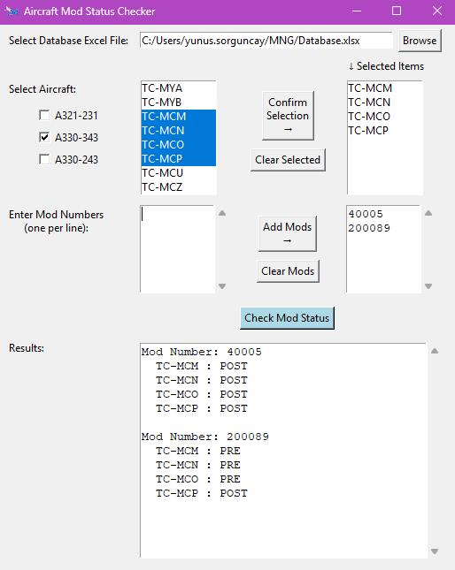
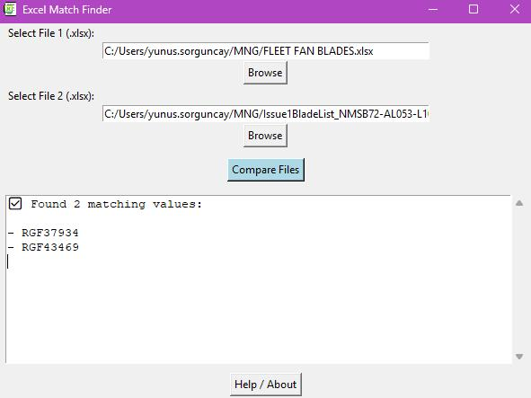

# Maintenance Planning Tools (Archive)

These software tools were programmed during my internship at MNG Airlines in 2025 to help fasten the workflow of the maintenance planning workers.

## Project Overview

This repository contains two Python GUI applications designed to streamline data processing and cross-referencing tasks that are common in maintenance planning.

1. **Aircraft Mod Status Checker**: A tool to cross-reference multiple aircraft and their modification statuses against a database.
2. **Excel Match Finder**: A tool to compare two Excel files and find matching cell values across all sheets without needing Microsoft Excel installed.

---

## 1. Aircraft Mod Status Checker



### Description
This application allows the user to select an Excel database file and easily check the implementation status (PRE or POST) of specific Modification (Mod) numbers across multiple aircraft. It saves time by automating the lookup process that would otherwise be done manually in large spreadsheets.

### Usage
1. Run the application.
2. Click **Browse** to select your Excel database file.
3. Select the target Aircraft (either by group or individually) and click **Confirm Selection**.
4. Enter the Mod Numbers you want to check (one per line) and click **Add Mods**.
5. Click **Check Mod Status** to generate a report showing whether the mod is "PRE" or "POST" for each selected aircraft.

---

## 2. Excel Match Finder



### Description
A utility designed to compare the contents of two distinct Excel (`.xlsx`) files. It scans all sheets and cells in both files and returns a list of any exact matching text values, regardless of their position or the sheet they are located in. 

### Usage
1. Run the application.
2. Click **Browse** next to **Select File 1** to pick your first `.xlsx` file.
3. Click **Browse** next to **Select File 2** to pick your second `.xlsx` file.
4. Click **Compare Files**.
5. Any matching values found between the two files will be displayed in the output box. 

> **Note**: Only `.xlsx` files are supported. Older `.xls` files must be converted to `.xlsx` format before using this tool.

---

## Getting Started (Running from Source)

### Prerequisites
To run these scripts from the source code, you need Python installed on your system along with the following libraries:

```bash
pip install pandas openpyxl
```
*(Tkinter is included with standard Python installations).*

### Running the Tools
Navigate to the respective folders and run the scripts:

```bash
# For Aircraft Mod Status Checker
cd Aircraft-Mod-Status-Checker
python aircraft_mod_status_checker.py

# For Excel Match Finder
cd Excel-Match-Finder
python excel_match_finder.py
```

---

## Executables
Pre-compiled standalone `.exe` files for Windows are available in the **Releases** section of this repository. You can download and run these executables directly without needing to install Python or any dependencies.
